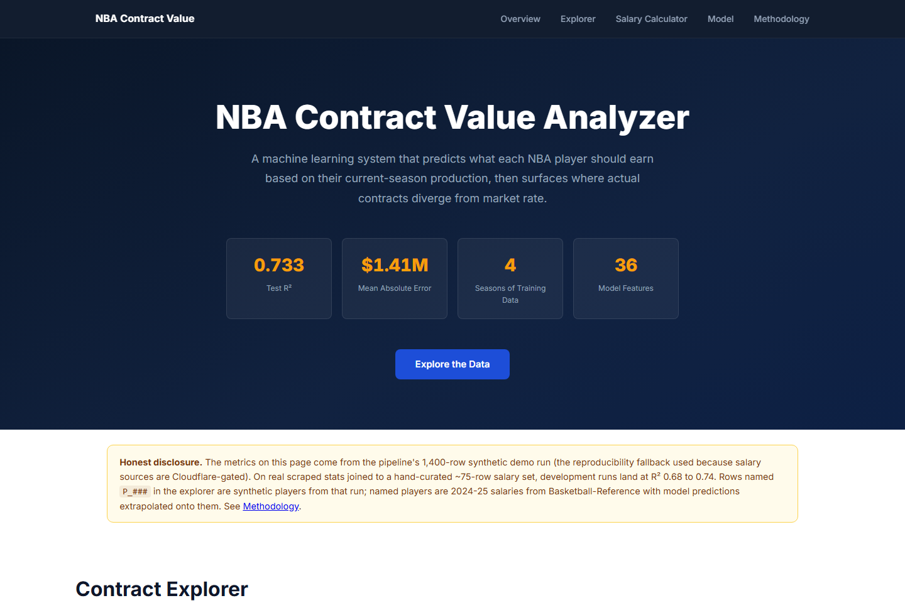

# NBA Contract Value Analyzer

[](https://github.com/bass990/NBA-Contract-Value-Analyzer/actions/workflows/ci.yml)
[](./LICENSE)
[](./runtime.txt)



*The site the Docker image serves at `/`. The disclosure box is on every page: the headline metrics come from the synthetic demo run, and the explorer marks synthetic rows.*

**Are NBA teams getting fair value from their contracts?**  
An end-to-end machine learning system that scrapes current player stats, predicts a market-rate salary for each player, and ranks the league's most overpaid and underpaid deals.

**[Methodology](./docs/METHODOLOGY.md)** — **[Report](./docs/REPORT.md)** — **[Deploy Notes](./huggingface-spaces/deployment_notes.md)**

Version 1.1 makes the model reproducible and honest at request time: `make train` rebuilds the committed bundle byte-for-byte (a CI job proves it), early stopping no longer peeks at the test season, every prediction carries an empirical 80% interval and a staleness flag, and the API monitors input drift with PSI against the training distribution.

---

## The Question

The 2024-25 NBA salary cap sits at $140.6 million per team. Front offices are making bets worth tens of millions on player performance, and the public data to evaluate those bets is freely available. Is a player's actual contract consistent with what a statistical model trained on four years of contract data would predict?

This project answers that question for every NBA player on a current deal, surfaces the largest discrepancies, and explains what drives each prediction.

## How It Works

1. **Scrape** current-season per-game and advanced stats from Basketball-Reference.
2. **Engineer features** — per-36 stats (normalizes for minutes), advanced metrics (PER, BPM, VORP, Win Shares), age polynomial (career arc), and position dummies (position-specific pay curves).
3. **Train** a LightGBM model on four seasons of historical salary data with a time-series split: seasons 2022-2023 train the model, 2024 drives early stopping, and the held-out 2025 season is evaluated once.
4. **Rank** players by the gap between predicted and actual salary.
5. **Surface** results via an interactive Streamlit dashboard.

## Results

> **Honest disclosure.** The numbers below are from a **1,400-row synthetic-data demo run** — the reproducibility fallback the pipeline uses when Basketball-Reference is unavailable or when the salary sources (Spotrac, HoopsHype) can't be reached. Both salary sources sit behind Cloudflare bot protection; bypassing them needs residential proxies or headless browser + CAPTCHA solving, neither of which belongs in a public portfolio project. On the real-data path, the pipeline scrapes Basketball-Reference for stats and joins them against a hand-curated **~75-row** salary dataset; development runs in that mode land in the **R² 0.68 – 0.74** range with higher dollar MAE due to greater variance in real NBA contracts. Methodology is identical between paths; only the data source differs. The synthetic vs. real-data tradeoff is documented in [METHODOLOGY.md §2](./docs/METHODOLOGY.md) and [REPORT.md §Data](./docs/REPORT.md).

Synthetic-run performance on the held-out 2025 season (350 players), from
[`artifacts/eval_report.json`](./artifacts/eval_report.json):

| Metric | v1.0 (notebook) | v1.1 (`scripts/train.py`) |
|---|---|---|
| R² (log salary) | 0.741 | **0.733** |
| MAE (log scale) | 0.293 | 0.295 |
| MAE (dollars) | $1,390,130 | $1,406,161 |
| MAPE | not reported | 25.7% |
| 80% interval coverage on test | no interval | **78%** |
| Training rounds | 90 | 85 (early stopping on 2024, not 2025) |

**Why the headline went down by 0.8 points and why that is the right direction.** The
notebook run used the 2025 test season as the early-stopping set
(`valid_sets=[dtest]`), so the number of trees was chosen by looking at the data it was
then evaluated on. `scripts/train.py` trains on 2022-2023, stops on 2024, and touches
2025 once. The slightly lower R² is the honest one; the old number had a small leak in it.

**Where the model is wrong.** Error by actual salary tier on the test season:

| Tier (actual salary) | Players | MAE | Bias | 80% interval coverage |
|---|---|---|---|---|
| Bench / reserve (< $7M) | 303 | $0.80M | -$0.44M | 83% |
| Role player ($7-15M) | 37 | $4.03M | -$2.18M | 49% |
| Starter ($15-25M) | 7 | $9.14M | -$9.14M | 43% |
| Star / max (> $25M) | 3 | $12.7M | -$12.7M | 67% |

The model under-predicts every tier above the bench and the gap grows with salary:
a log-target model trained on a bench-heavy distribution regresses stars toward the
middle, and the synthetic generator caps salaries at $60M so the top of the range is
thin. The 80% interval is honest on the bench (83%) and too narrow for anyone paid
above $7M (43-49%). Both facts are on `/model-info` and in every prediction's interval,
rather than hidden behind the aggregate R².

Top predictors by LightGBM gain: **PER (25%), Win Shares (19%), Age (17%), VORP (16%)**.
Composite efficiency stats outperform raw counting stats, consistent with how front
offices evaluate players in contract negotiations.

The ~27% of unexplained variance reflects real-world factors the model cannot observe:
contract timing relative to cap growth, market-size premiums, injury history, and
negotiating leverage.

## Project Structure

```
nba-contract-value/
├── src/
│   ├── scraper/                # Basketball-Reference scraper (polite, cached, retry logic)
│   ├── pipeline/               # Feature engineering: per-36, position dummies, age poly
│   ├── model/                  # LightGBM training, Optuna tuning, evaluation
│   └── app/                    # Streamlit dashboard
├── api/                        # FastAPI service wrapping the trained model
│   ├── main.py                 # Endpoints, lifespan loader, intervals, staleness, request logging
│   ├── schemas.py              # Pydantic v2 PlayerStats + response models
│   └── monitoring.py           # PSI drift against the training distribution stored in the bundle
├── scripts/train.py            # Deterministic training run -> model.pkl + artifacts/eval_report.json
├── artifacts/eval_report.json  # Held-out metrics, error by tier / position, interval coverage
├── data/
│   ├── raw/                    # Scraped HTML cache and parsed CSVs
│   └── processed/model.pkl     # Committed model bundle (reproducible with `make train`)
├── notebooks/                  # End-to-end pipeline notebook with embedded outputs
├── tests/                      # 49 pytest tests: feature pipeline, API contract, golden, determinism, drift
├── docs/                       # Methodology writeup and evaluation report
├── website/                    # Standalone HTML/CSS/JS site
├── huggingface-spaces/         # HF Spaces deploy artifacts (app.py, requirements.txt, README, notes)
├── .github/workflows/ci.yml    # ruff + pytest (incl. retrain-and-compare) + Docker smoke on every push / PR
├── Dockerfile                  # Lean inference image for the API
├── Makefile                    # make train / make test / make lint / make api / make docker-smoke
├── LICENSE                     # MIT
├── ruff.toml                   # Lint config — respects existing compact-style code
├── requirements.txt            # Full training + scraping environment
└── requirements-api.txt        # Lean API runtime (fastapi, uvicorn, lightgbm, pandas)
```

## Quick Start

```bash
git clone https://github.com/bass990/NBA-Contract-Value-Analyzer
cd NBA-Contract-Value-Analyzer
python -m venv .venv && source .venv/bin/activate  # Windows: .venv\Scripts\activate
pip install -r requirements.txt

# Reproduce the committed model bundle + evaluation report (synthetic data, seed 42, ~10 s)
make train

# Real-data path: scrape Basketball-Reference, then retrain on the curated salaries
make scrape

# Dashboard
make app
# Opens at http://localhost:8501
```

Or run the notebook: `notebooks/NBA_Contract_Value_END_TO_END.ipynb`

## FastAPI Service

The trained model is also exposed as a production-shaped HTTP service. The
Streamlit dashboard is for visual exploration; the FastAPI app is the
integration surface (Vue/React frontend, batch scoring job, etc.).

### Endpoints

| Method | Path | Purpose |
|---|---|---|
| `GET`  | `/health`        | Liveness + readiness, test season, drift reference loaded, uptime |
| `GET`  | `/model-info`    | Honest model card: features, R², MAE, **synthetic-data caveat**, seasons trained / validated / tested, interval coverage, error by tier, top features, `stale_after_season` |
| `POST` | `/predict`       | Score one player-season: USD point estimate, **80% interval**, tier, % of cap, **`stale` flag** |
| `POST` | `/predict-batch` | Score up to 1,000 player-seasons in one round-trip; batches of 50+ get a PSI drift summary |
| `POST` | `/drift`         | PSI of a batch's model features and predicted log-salary against the training distribution |
| `GET`  | `/docs`          | Swagger UI |
| `GET`  | `/openapi.json`  | OpenAPI 3.1 schema |

The API accepts **raw per-game + advanced stats** (PTS, USG%, etc.) — the shape
a basketball reader actually has — and runs them through the same
`src/pipeline/features.py` transforms that built the training table (per-36,
position dummies, role flags, age polynomial). Pydantic v2 with `extra='forbid'`
rejects unknown fields, negative minutes, non-basketball positions, and out-of-range
shooting percentages at the boundary.

### Run locally

```bash
pip install -r requirements-api.txt
uvicorn api.main:app --host 0.0.0.0 --port 8000 --reload
# → http://localhost:8000/docs
```

### Run in Docker

```bash
docker build -t nba-api .
docker run --rm -p 8000:8000 nba-api
# http://localhost:8000/       the website (explorer + salary estimator, calls this API on the same origin)
# http://localhost:8000/docs   the interactive API docs
curl http://localhost:8000/health
```

### Example request

```bash
curl -X POST http://localhost:8000/predict \
  -H "Content-Type: application/json" \
  -d '{
    "Player": "Test Guard", "season": 2025, "Age": 27, "Pos": "PG",
    "G": 70, "GS": 70, "MP": 35.0,
    "PTS": 28.5, "TRB": 5.5, "AST": 8.0, "STL": 1.3, "BLK": 0.4, "TOV": 3.1,
    "FGA": 20.5, "3PA": 9.0, "FTA": 7.0,
    "FG%": 0.480, "3P%": 0.380, "FT%": 0.890, "eFG%": 0.560,
    "PER": 24.0, "TS%": 0.610, "USG%": 32.0,
    "WS": 9.5, "WS/48": 0.180,
    "BPM": 6.0, "OBPM": 5.0, "DBPM": 1.0, "VORP": 4.5
  }'
```

```json
{
  "predictions": [{
    "Player": "Test Guard", "season": 2025,
    "predicted_usd": 18298293, "predicted_m": 18.3,
    "tier": "Starter", "cap_pct_2025": 13.0,
    "interval_80_low_usd": 13039526, "interval_80_high_usd": 30554844,
    "stale": false
  }],
  "drift": null
}
```

### Honest disclosure

`/model-info` returns the synthetic-data caveat as a structured field so the
caveat travels with every consumer of this API:

> Headline metrics (R² 0.733, MAE $1.41M) are from a synthetic-data run (seed 42,
> 1,400 player-seasons), the pipeline's reproducibility fallback: the salary sources
> (Spotrac, HoopsHype) sit behind Cloudflare and were not scraped. Real-data dev runs on
> a hand-curated ~75-row salary set land in R² 0.68-0.74. The 80% interval comes from
> validation-season residuals and covered 78% of test-season salaries; it is widest,
> and least reliable, for max contracts, which the synthetic generator caps at $60M.

**Intervals and staleness.** The bundle stores the 10th / 90th percentile of the
validation-season residuals (log scale); every prediction multiplies its point estimate
by `exp(q10)` and `exp(q90)` to give an empirical 80% interval, and `/model-info` reports
the coverage that interval actually achieved on the test season. A request for a season
more than one past the newest season the model has seen (2024 validation, so anything
after 2025) is returned with `stale: true`, because the salary cap grows every year and
the model has never seen that cap.

**Drift monitoring** ([`api/monitoring.py`](./api/monitoring.py)): `scripts/train.py`
stores 10-bin histograms of every model feature and of the predicted log-salary on the
training seasons inside the bundle. `/drift` (or any batch of 50+ players) reports the
Population Stability Index per feature, stable (< 0.10) / moderate (0.10-0.25) /
shifted (> 0.25), plus the PSI of the prediction distribution and its median against the
training median.

### Tests

```bash
make test        # 49 tests, no network
```

- `tests/test_features.py`: the feature pipeline (per-36, dummies, role flags, leakage guard).
- `tests/test_api.py`: the HTTP contract (health, model card, single + batch scoring, schema rejection).
- `tests/test_contract.py`: **determinism** (retrains from the seed in a temp dir and must
  reproduce the committed bundle's R², MAE and tree count exactly), **golden predictions**
  (three frozen stat lines must score to the frozen salaries within $1), intervals and the
  staleness flag, **adversarial inputs** (zero minutes, zero games, ages 18 and 50, stats
  beyond anything in training, zero shooting percentages, multi-position labels; and the
  out-of-range values the schema must reject), batch limits, and **drift** (a batch of
  clones of one superstar is flagged on PER and on the prediction distribution).

### Design notes

- The model loads **once** at startup via FastAPI's `lifespan`. A warm-up row is
  pushed through `predict_salary` so the LightGBM dispatch is hot before traffic.
- Every response carries `X-Request-ID` and `X-Process-Time-Ms`; each scoring request
  writes one JSON log line.
- The model bundle is committed (about 300 KB) *and* reproducible: `scripts/train.py`
  sets LightGBM's `seed`, `deterministic=True` and a single thread, so CI can retrain
  and diff the metrics against the committed file.
- Position dummies are post-processed to materialize all five `pos_*` columns
  even for single-row requests — `pd.get_dummies` only emits columns for
  positions present, and the model expects the full one-hot block.
- Docker base ships `libgomp1` (LightGBM's runtime OpenMP dependency).
- CORS is open (`*`) for the portfolio demo; lock it down before deploying.

## What went wrong along the way

**Early stopping on the test season.** The notebook chose the number of boosting rounds by watching the 2024-25 season, then reported R² 0.741 on that same season. Retraining with early stopping on the 2024 validation season gives 0.733 and MAE $1,406,161. The determinism test in `tests/test_contract.py` retrains from the seed and must reproduce the committed bundle exactly, so the number cannot quietly drift back up.

**Fixing the number in one place.** After the retrain the README said 0.733, and the website, the website's script comments and the Streamlit dashboard all still said 0.741 and $1.39M. I found the last one weeks later. They agree now; a metric that lives in more than one file needs a test that compares them, which is on the list.

**Synthetic players in the explorer.** Rows like `P_025, PG, 30, $3.6M` came from the synthetic test set and sat between real 2024-25 contracts with nothing to tell them apart. The explorer hides them by default and badges them when shown, the page carries the same disclosure box the dashboard had, and `/model-info` returns the caveat as a field.

**An estimator that was not the model.** The website's salary estimator used hand-fitted coefficients while the copy said it used the trained pipeline's feature logic. It now posts to the running API and shows the prediction, the 80% interval and the staleness flag. If the API is down it falls back to the coefficients and says so on screen.

**The predictions file lagged the model by four months.** The file the explorer reads was generated in May by the notebook, before the September retrain, so the per-player rows came from the old model while the headline metrics used the new one. Nobody would have noticed from the dashboard. Regenerating it was a notebook step, which is exactly why it had not been re-run, so it is now `make predictions`: the script scores the held-out season with the committed bundle and refuses to write the file unless the scored R² matches the bundle's headline to six decimals. The Space was republished from that output on 2026-09-30.

## Modeling Decisions

| Decision | What | Why |
|---|---|---|
| Target | log(annual_salary) | Right-skewed distribution; log makes MAE symmetric across the salary range |
| Algorithm | LightGBM | Best tabular performance at this dataset size; handles missingness natively |
| Validation | Time-series split | Random CV leaks future cap information into past training |
| Features | Per-36, advanced stats, age polynomial, position dummies | See `docs/METHODOLOGY.md` for full reasoning |
| Metric | R² + MAE in dollars | R² for model quality narrative; MAE for business interpretation |

Full reasoning, including alternatives considered, is in [`docs/METHODOLOGY.md`](./docs/METHODOLOGY.md).

## Limitations

- The model predicts based on on-court production. Teams also pay for market size, leadership, injury risk, and contract negotiating dynamics — none of which appear in the stats.
- Contracts signed years ago compare against current market rates. The age and cap-inflation features partially correct for this.
- Scraping is inherently fragile. Basketball-Reference's HTML can change; the scraper caches pages to disk to reduce re-scrape frequency.
- Salary data coverage is limited to the curated ~75 player-season dataset or a user-provided HoopsHype CSV. Full-league coverage requires a once-per-season manual download.
- The synthetic generator caps salaries at $60M and produces few high earners (10 of 350 test players above $15M), so the model under-predicts stars and the interval is too narrow above $7M. Those are measured, not guessed: see the tier table above.
- The interval is empirical and global (one residual distribution for every player). A conformal or quantile-regression interval per tier is the next modelling step.

## Tech Stack

Python 3.12 — `requests` + `beautifulsoup4` for scraping — `pandas` for ETL — `lightgbm` + `scikit-learn` + `optuna` for modeling — `streamlit` + `plotly` for the dashboard

## License

[MIT](./LICENSE). Basketball-Reference data is the property of Sports Reference LLC and is used for personal, non-commercial purposes; NBA team and player names are trademarks of their respective owners.

## Author

Mamadou Bassirou Diallo  
MS Business Analytics & AI (Data Science), UT Dallas  
[LinkedIn](https://www.linkedin.com/in/mamadou9905) — [GitHub](https://github.com/bass990)
